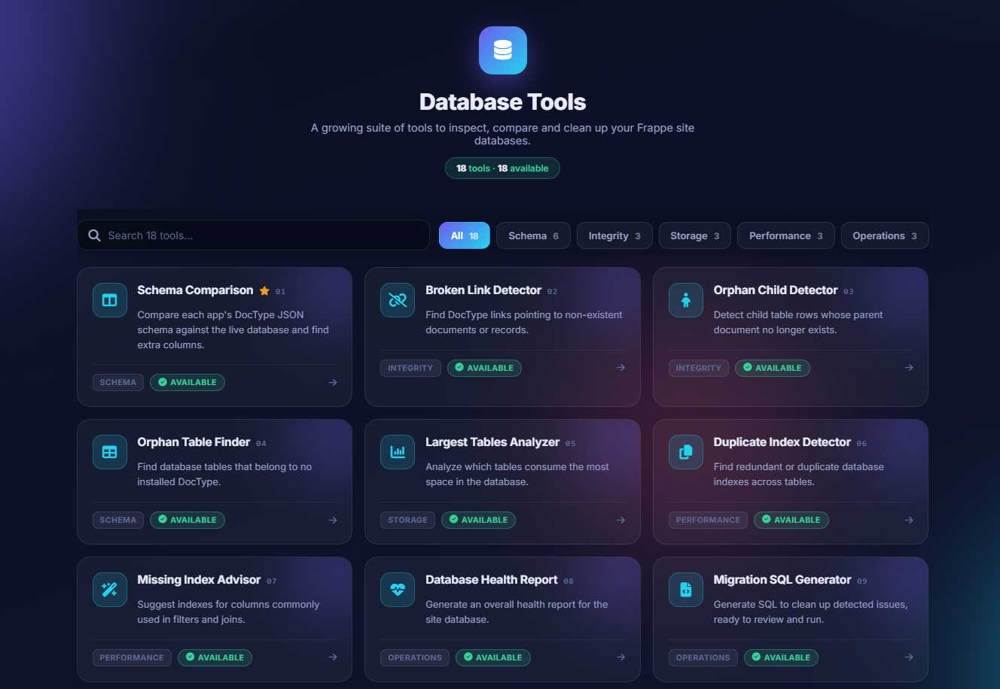
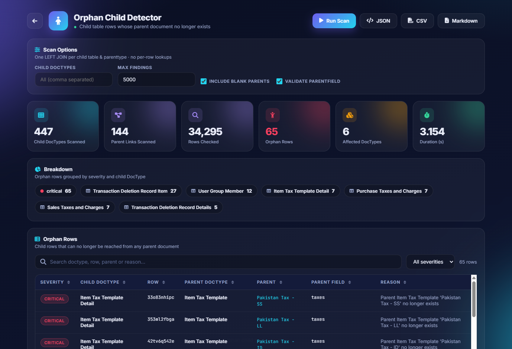
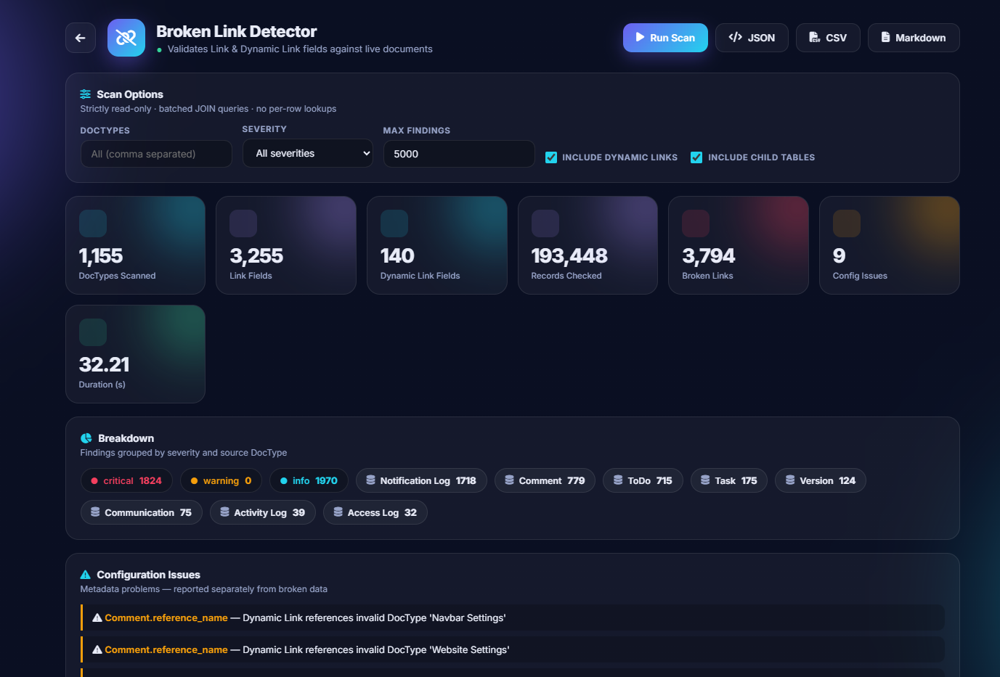
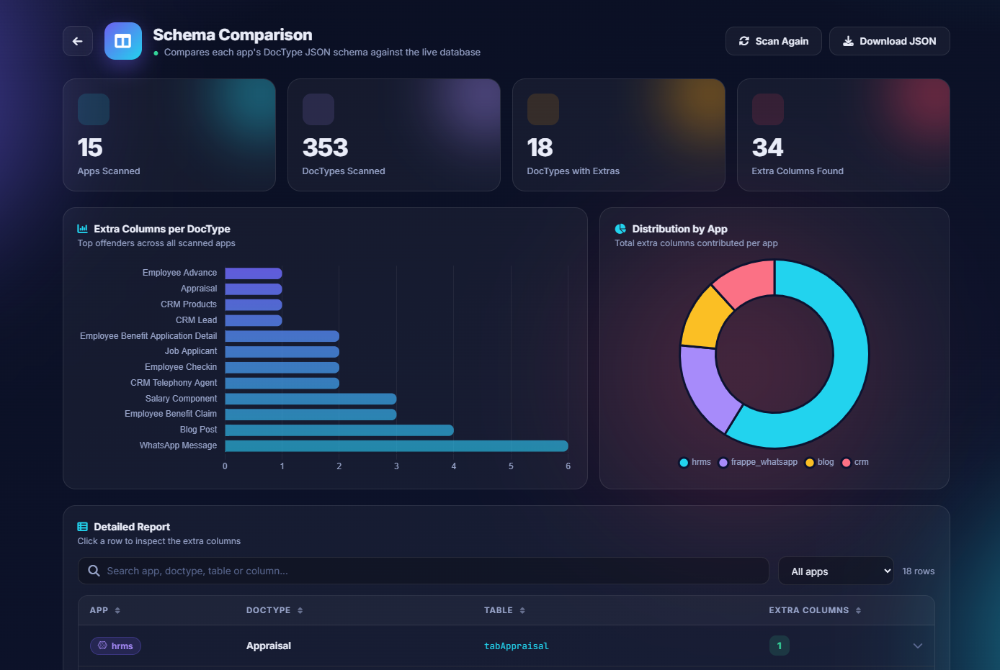

# Database Tools

A suite of **read-only** database inspection tools for [Frappe](https://frappeframework.com)
sites, served as a set of web pages under `/db_tools`.

It answers the questions that are awkward to answer from the desk UI: which tables are
eating the disk, which links point at documents that no longer exist, which columns
nobody ever filled in, why a migration is about to fail — and it answers them by reading
the live database rather than guessing from the schema files.

Nothing in this app writes, alters or deletes. Where a fix is obvious it is emitted as
SQL for a human to review and run.

## What it looks like

**The hub** — all eighteen tools, searchable and filtered by category.



**Orphan Child Detector** — 34,295 child rows checked in about three seconds, 65 of them
no longer reachable from any parent, each with the reason it was flagged.



<details>
<summary><b>More screenshots</b></summary>

<br>

**Broken Link Detector** — a scan across 193,000 records, with findings grouped by
severity and source DocType, and configuration problems reported separately from broken
data.



**Schema Comparison** — summary tiles, a breakdown of which apps contribute the drift,
and a filterable, sortable report.



</details>

<!--
  Adding a screenshot: drop the PNG in db_tools/public/images/ and add a line inside
  the collapsible "More screenshots" block above, as

      

  Paths must stay repo-relative — GitHub resolves them from the README, and /assets/
  URLs only exist on a running bench.
-->

---

## The tools

Eighteen tools, all working. Each one is a page with filters and a sortable, searchable
table, and every report can be pulled as JSON, CSV or Markdown — from the page, or
straight from the API.

### Schema

| | Tool | What it does |
|---|---|---|
| 01 | **Schema Comparison** | Columns in the database that no DocType field accounts for |
| 04 | **Orphan Table Finder** | `tab*` tables belonging to no DocType, and DocTypes with no table |
| 11 | **Schema Drift Detector** | Fields with no column, and columns whose SQL type drifted |
| 15 | **Charset & Collation Auditor** | Tables and columns that deviate from the database default |
| 17 | **Row Size Auditor** | Inline row size per table against the 65,535-byte SQL limit |
| 18 | **MariaDB Limits Auditor** | Identifiers, columns, indexes, key bytes, row size and `AUTO_INCREMENT` against the limits this server actually enforces |

### Integrity

| | Tool | What it does |
|---|---|---|
| 02 | **Broken Link Detector** | Link and Dynamic Link values pointing at missing documents |
| 03 | **Orphan Child Detector** | Child rows whose parent document no longer exists |
| 14 | **Customization Auditor** | Custom Fields, Property Setters and scripts that dangle |

### Performance

| | Tool | What it does |
|---|---|---|
| 06 | **Duplicate Index Detector** | Exact duplicates and redundant prefix indexes |
| 07 | **Missing Index Advisor** | Indexes worth adding, weighted by how large the table is |
| 16 | **Fragmentation Analyzer** | Space trapped inside tables, plus engine and row-format drift |

### Storage

| | Tool | What it does |
|---|---|---|
| 05 | **Largest Tables Analyzer** | Data, index and total bytes per table, as a share of the database |
| 12 | **Empty Column Analyzer** | Columns never populated, or holding a single value on every row |
| 13 | **Log Table Analyzer** | Log and history growth against the retention set in Log Settings |

### Operations

| | Tool | What it does |
|---|---|---|
| 08 | **Database Health Report** | Every check above rolled into one 0–100 score |
| 09 | **Migration SQL Generator** | The findings turned into a reviewable SQL script |
| 10 | **Site Schema Comparison** | Diffs the live schema of two sites on the same bench |

---

## Installation

```bash
cd $PATH_TO_YOUR_BENCH
bench get-app https://github.com/muqeetmughal/db_tools --branch develop
bench --site <your-site> install-app db_tools
```

Then open **`https://<your-site>/db_tools`**.

There is no build step — the styles and frontend live inside a Jinja template, so a page
edit is visible on reload.

### Requirements

- Frappe v15 or newer, Python 3.10+ — developed and tested against Frappe v16
- **MariaDB or MySQL.** Most tools read `information_schema` directly and will refuse to
  run on Postgres rather than return numbers that look right but are not.

---

## Access

The whole app is restricted to the **System Manager** role, in two layers:

- **Pages** redirect guests to login and return 403 for a logged-in user without the role.
- **Endpoints** check permission themselves, so the API cannot be reached by skipping the
  page.

These tools expose schema and row-level detail about your site, so none of it is public.
To widen access, change `ALLOWED_ROLES` in `db_tools/backend/common.py` — the single
place it is defined.

---

## Safety

Every tool is read-only. Scans use batched `JOIN` and `GROUP BY` queries against
`information_schema` or the tables themselves — never a query per row — so they stay
usable on sites with millions of records.

The Migration SQL Generator is the one tool that produces something you could run. It
still executes nothing: it emits a script, groups it by risk, and **comments out every
destructive statement** (`DROP COLUMN`, `DROP TABLE`, `DELETE`) so nothing runs by
accident. Take a backup before acting on it:

```bash
bench --site <your-site> backup
```

---

## Using the API directly

Every tool is a whitelisted method, useful for scripting or CI:

```bash
bench --site <your-site> execute \
  db_tools.backend.database_health_report.api.get_health_report
```

Or over HTTP, as a System Manager:

```
GET /api/method/db_tools.backend.largest_tables_analyzer.api.get_largest_tables_report?limit=20
```

Every report endpoint accepts `fmt=csv` or `fmt=markdown` to get a rendered report
instead of the structured payload. The Migration SQL Generator also accepts `fmt=sql`.

---

## Contributing

`AGENTS.md` documents the architecture: the tool registry, the shared permission gate and
renderers, the frontend engine that each page configures, and the false-positive classes
that have already been found and fixed. Read it before adding a tool.

This app uses `pre-commit` for formatting and linting — ruff, eslint, prettier and
pyupgrade. [Install pre-commit](https://pre-commit.com/#installation), then:

```bash
cd apps/db_tools
pre-commit install
```

## Author

Built by **Muqeet Mughal** — Frappe / ERPNext developer.

[](https://www.linkedin.com/in/muqeetmughal/)
[](https://github.com/muqeetmughal)

If this app saved you a painful afternoon, a note on
[LinkedIn](https://www.linkedin.com/in/muqeetmughal/) is always welcome.

## License

MIT
